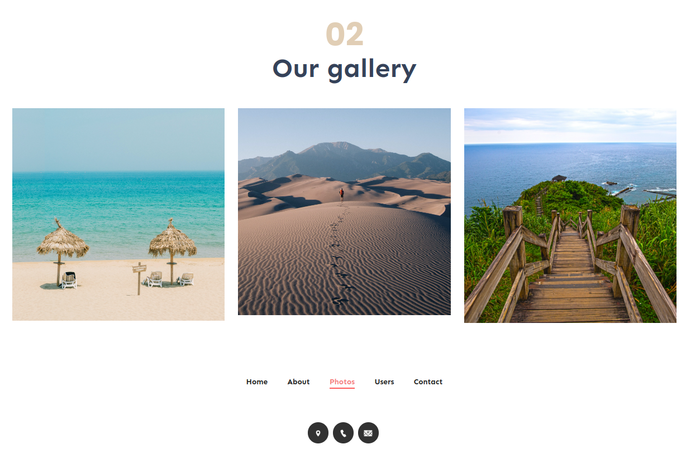

# PhotoDump Project

## Tools
- Node.js, Express.js, MongoDB, Mongoose, EJS Template Engine

## Features

- **Login**: Der User kann sich in seinen Account einloggen
- **Register**: Der User kann sich einen Account erstellen und dann meldet sich damit automatisch an
- **Logout**: Der User kann sich aus seinem Account wieder ausloggen
- **Neues Foto hinzufügen**: Der User kann über ein Formular Name, Description und neue Foto angeben. Diese Photo wird dann in einer Datenbank gespeichert.
- **Fotos**: Es können Foto erstellt werden. Diese werden auf dem Server mit mongodb gespeichert. Der User kann eine Liste von Fotos (in Photos-Page) sehen. Er kann eine Detailansicht der Foto sehen wo mehr als nur der Name enthalten ist.

### Optional Features - 1

- **Photo-Update**: Der User kann seine persönlichen Fotos ändern (Name & Description & Foto)
- **Kontakt**: Es gibt ein Formular in Contact-Page. Der User kann über dies Formular uns ein Message senden. 

## Models

 
 

